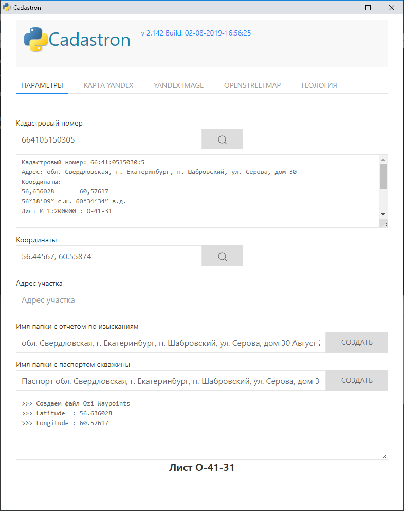
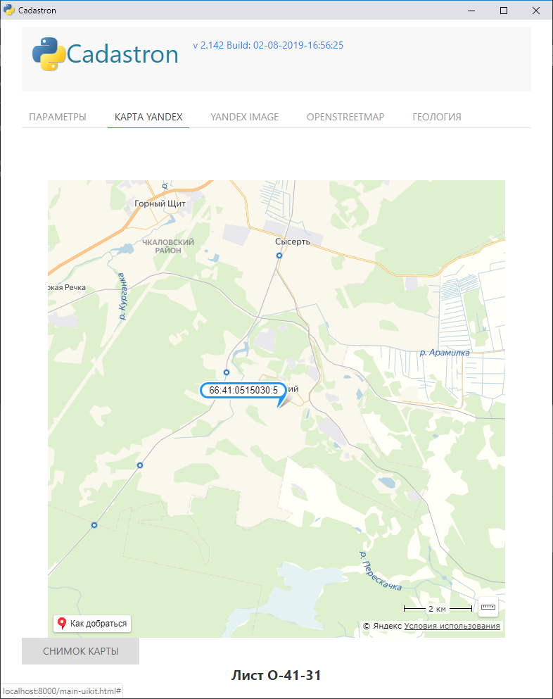
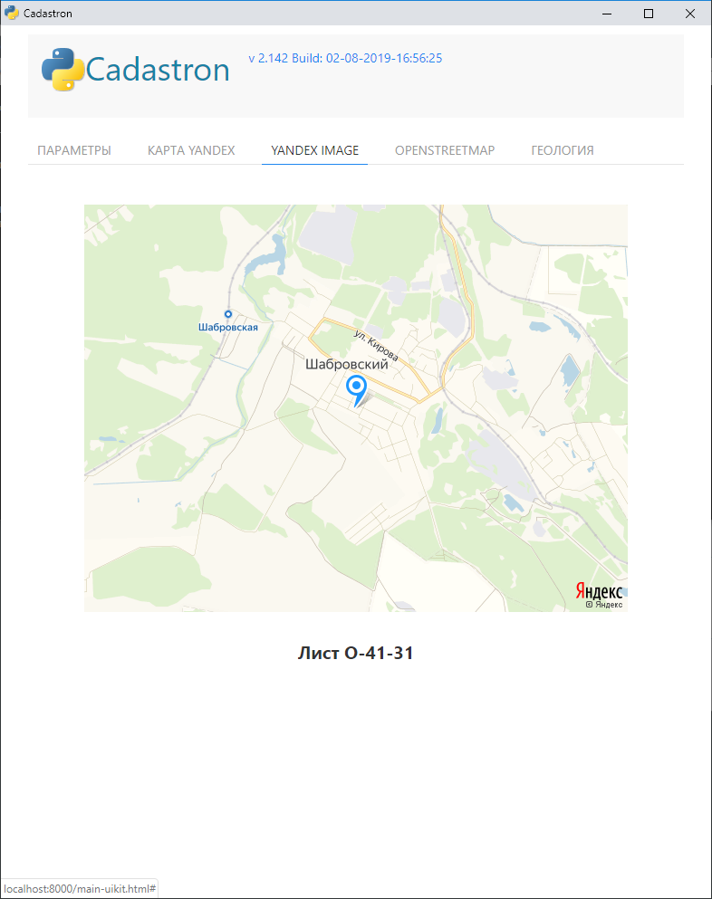

<h1 align="center">Cadastron</h1>
<p align="center">Получение информации по участку по его кадастровому номеру. GUI основан на Python пакете <a href="https://github.com/ChrisKnott/Eel">Eel</a></p>
<p align="center">Идею GUI подсмотрел в проекте <a href="https://github.com/brentvollebregt/auto-py-to-exe/"><strong> Auto PY to EXE </strong></a></p>
<p align="center">Также пользовался описанием Eel из статьи <a href="http://nitratine.net/python-gui-using-chrome/"><strong> Python GUI Using Chrome </strong></a></p>

<!-- <div align="center">
    
</div> -->

## Getting Started

### Требования к системе
 - Python : Python 3.3+ 
 - Chrome : библиотека Eel использует Chrome в режиме приложения

### Установка
1. Клонировать/скачать этот репозиторий
2. Открыть ```cmd/terminal``` и перейти в папку с проектом
3. В папку ```web/geomap``` скопровать тайлы геологической карты (лежат тут: ```D:\Home System\РАЗНОЕ\Государственная геологическая карта РФ Урал\Сводная карта Урала - тайлы\geomap```)
4. Установить локальный веб-сервер (IIS), с домашним каталогом ```web/geomap``` 
( В настоящее время локальный веб-сервер не используется, тайлы геокарты лежат здесь: http://ex1c.delrus.ru/geomap/{z}/{x}/{y}.png)
5. Если не установлен пакет pyvenv, поставим его (под Windows можно так: ```pip3 install virtualenv```)
6. Установить виртуальное окружение ```virtualenv venv```
7. Активировать виртуальное окружение ```venv\Scripts\Activate```
8. Установить зависимости ```pip install -r requirements.txt```
9. При необходимости изменить настройки в файле ```settings.py``` 

## Запуск
Активировать виртуальное окружение ```venv\Scripts\Activate```

Запустить приложение: ```python run.py``` 

Chrome запустится в режиме приложения с этим проектом внутри.

## TODO
- ~Выводить Yandex карту в отдельном поле~

- ~Геологическая карта~

- Входной параметр - координаты, а не кадастровый номер


## Something is Wrong?
There could be a chance that you were using an old version and I have changed something and your cache is now a mess. Press Shift+F5 in the chrome app to force reload everything.

If this doesn't work please report it and I will look into it!

## Screenshots







``

``

``

