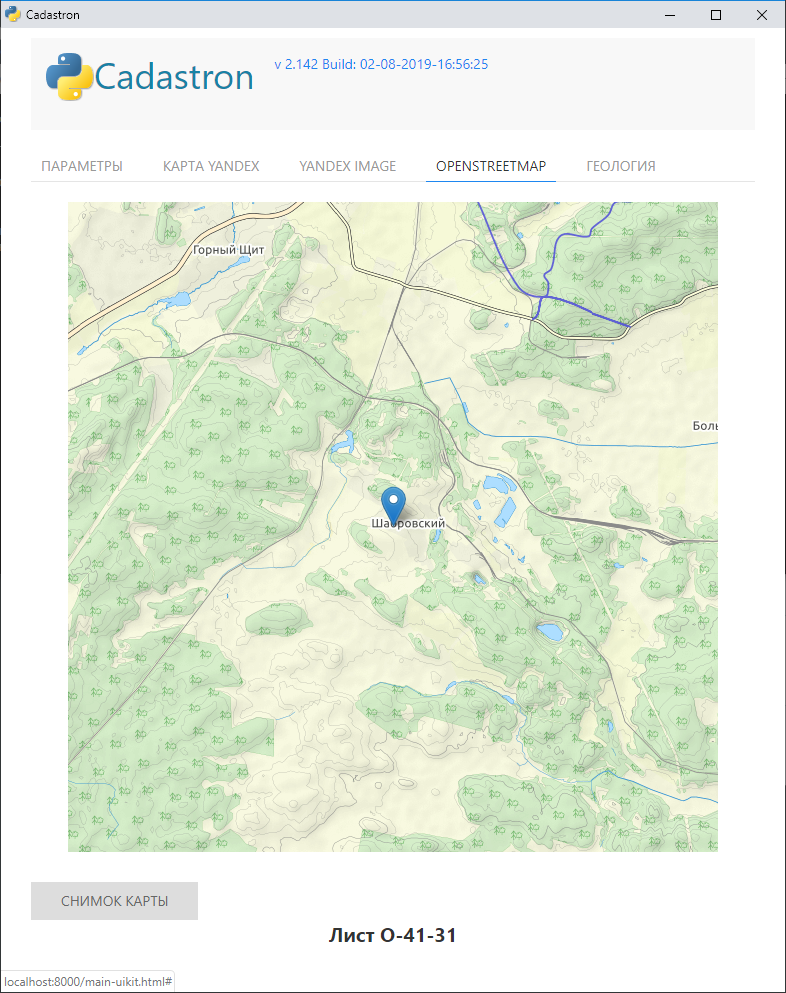
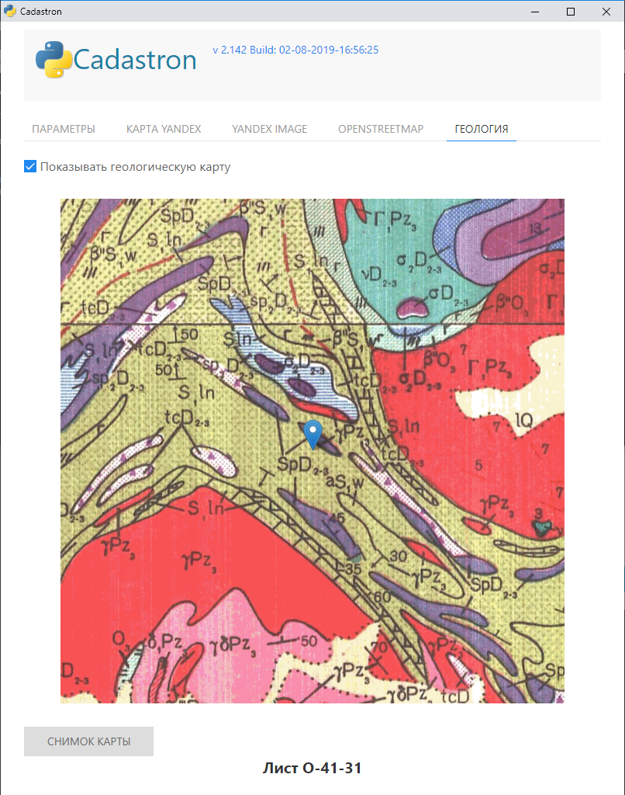

<h1 align="center">Cadastron</h1>
<p align="center">Получение информации по участку по его кадастровому номеру либо координатам, создание отчета по изысканиям из шаблона, создание паспорта скважины из шаблона. GUI основан на Python пакете <a href="https://github.com/ChrisKnott/Eel">Eel</a></p>
<p align="center">Идею GUI подсмотрел в проекте <a href="https://github.com/brentvollebregt/auto-py-to-exe/"><strong> Auto PY to EXE </strong></a></p>
<p align="center">Также пользовался описанием Eel из статьи <a href="http://nitratine.net/python-gui-using-chrome/"><strong> Python GUI Using Chrome </strong></a></p>

<!-- <div align="center">
    
</div> -->

# Getting Started

## Требования к системе

    - Python : Python 3.3+
    - Chrome : библиотека Eel использует Chrome в режиме приложения

## Установка

- Клонировать/скачать этот репозиторий
- Если в системе не установлен Chrome, установить его
- Открыть ```cmd/terminal``` и перейти в папку с проектом
- В папку ```web/geomap``` скопровать тайлы геологической карты (лежат тут: ```D:\Home System\РАЗНОЕ\Государственная геологическая карта РФ Урал\Сводная карта Урала - тайлы\geomap```) (Если используется внешний веб-сервер, то тайлы копировать не надо)!
- Установить локальный веб-сервер (IIS), с домашним каталогом ```web/geomap``` 
( В настоящее время локальный веб-сервер не используется, тайлы геокарты лежат здесь: `https://ex1c.delrus.ru/geomap/{z}/{x}/{y}.png`). Этот URL присваивается переменной `urlTemplate` в файле `web/js/script.js`. 
Проверить наличие файла `.htaccess` в папке geomap (в файле должна быть строка `Header set Access-Control-Allow-Origin "*"`, разрешающая CORS, кроме того,  веб-сервер должен работать по протоколу `SSL`!
- Если не установлен пакет `pyvenv`, поставим его: `$ sudo apt install -y python3-venv` (под Windows можно так: `pip3 install virtualenv`)
- `$ pyvenv venv` создаем виртуальное окружение python3 (под Windows: `> virtualenv venv` )
- `$ source venv/bin/activate` Активируем виртуальное окружение (под Windows: `> venv\Scripts\activate`)
- `(venv) $ pip3 install -r requirements.txt` Устанавливаем необходимые пакеты и библиотеки в виртуальное окружение
- При необходимости изменить настройки в файле ```settings.py```
- Скопировать файл ```hooks/pre-commit``` в папку ```.git/hooks```. Это скрипт, автоматически меняющий номер версии и дату сборки проекта в файле ```app/__init__.py``` перед каждым коммитом

## Запуск

- Активировать виртуальное окружение ```venv\Scripts\Activate```

- Запустить приложение: ```python run.py```

- Можно создать файл cadastron.cmd и запускать его:

#### Файл cadastron.cmd
    cd d:
    cd \GIT-REPOS\cadastron
    call venv\Scripts\Activate
    python run.py

#### Файл cadastron-uikit.cmd
    cd d:
    cd \GIT-REPOS\cadastron
    call venv\Scripts\Activate
    python run-uikit.py

- **Chrome** запустится в режиме приложения с этим проектом внутри.

## Два варианта дизайна
    cadastron.cmd - С использованием оформления в стиле Bootstrap
    cadastron-uikit.cmd - С использованием оформления в стиле UIkit
    

## TODO

- ~Добавить входной параметр - координаты участка~
- Использовать наряду с Yandex картой красивую карту из проекта https://www.thunderforest.com/ (Outdoors, LandScape)


## Screenshots


### Дизайн UIkit







